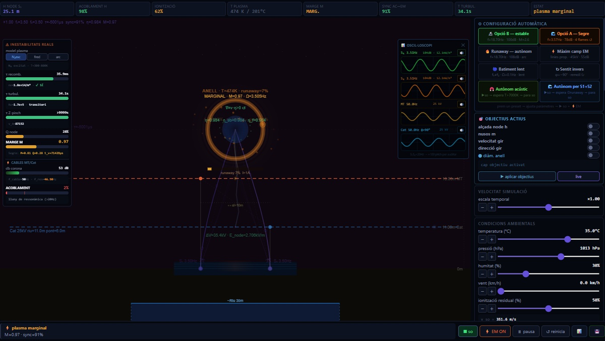

# Velo Toroide - Laboratori de Plasma



---

## Project: Observation and Analysis of the Segre River Phenomenon (2022)

**🌐 [Simulation web](https://bioquad.github.io/Velo-Toroide/)**

### Description

This repository contains factual documentation and theoretical analysis based on the observation of a toroidal light phenomenon recorded on September 18, 2022, in Lleida. The objective is to provide precise data to the scientific community and researchers interested in anomalous atmospheric phenomena.

### Repository Structure

```
.
├── /assets
│   ├── Planol fets.png
│   ├── Toroide fets.png
│   └── View_001.jpg
├── /dat
├── /docs
│   ├── Explicacio_observacio_toroide_cat.docx
│   ├── Explicacio_observacio_toroide_eng.docx
│   ├── Explicacio_simulacio_toroide_cat.docx
│   └── Explicacio_simulacio_toroide_eng.docx
├── /simulation
│   └── index.html
├── LICENSE.txt
└── README.md
```

### Repository Contents

- **`/assets`**: Contains the project's graphic resources, including maps and representations of the toroid.
- **`/dat`**: Directory reserved for data used in observations and simulations.
- **`/docs`**: Technical and explanatory documentation available in both Catalan and English.
- **`/simulation`**: Contains the source code for the simulation (index.html).

### Documentation Structure

1. **Observation report**: Objective description, coordinates, and environmental data.
2. **Physical Simulation**: Theoretical analysis based on plasma physics, electrodynamics, and fluid dynamics.

### License

This project is distributed under the [Creative Commons Attribution 4.0 International](https://creativecommons.org/licenses/by/4.0/) license. Its use is permitted provided the source is attributed.

### Note

The physical models presented are working hypotheses and have not been experimentally validated.

---

## Projecte: Observació i Anàlisi del Fenomen del Riu Segre (2022)

### Descripció

Aquest repositori conté la documentació factual i l'anàlisi teòrica basada en l'observació d'un fenomen lluminós toroïdal registrada el 18 de setembre de 2022 a Lleida. L'objectiu és proporcionar dades precises a la comunitat científica i a investigadors interessats en fenòmens atmosfèrics anòmals.

### Estructura del repositori

```
.
├── /assets
│   ├── Planol fets.png
│   ├── Toroide fets.png
│   └── View_001.jpg
├── /dat
├── /docs
│   ├── Explicacio_observacio_toroide_cat.docx
│   ├── Explicacio_observacio_toroide_eng.docx
│   ├── Explicacio_simulacio_toroide_cat.docx
│   └── Explicacio_simulacio_toroide_eng.docx
├── /simulation
│   └── index.html
├── LICENSE.txt
└── README.md
```

### Contingut del repositori

- **`/assets`**: Conté els recursos gràfics del projecte, incloent plànols i representacions del toroide.
- **`/dat`**: Directori reservat per a les dades utilitzades en les observacions i simulacions.
- **`/docs`**: Documentació tècnica i explicativa disponible tant en català com en anglès.
- **`/simulation`**: Conté el codi font de la simulació (index.html).

### Estructura de la documentació

1. **Explicació observació toroide**: Descripció objectiva, coordenades i dades ambientals.
2. **Simulació Física**: Anàlisi teòrica basada en física de plasmes, electrodinàmica i dinàmica de fluids.

### Llicència

Aquest projecte es distribueix sota la llicència [Creative Commons Attribution 4.0 International](https://creativecommons.org/licenses/by/4.0/). Es permet el seu ús sempre que s'atribueixi la font.

### Nota

Els models físics presentats són hipòtesis de treball i no han estat validats experimentalment.
