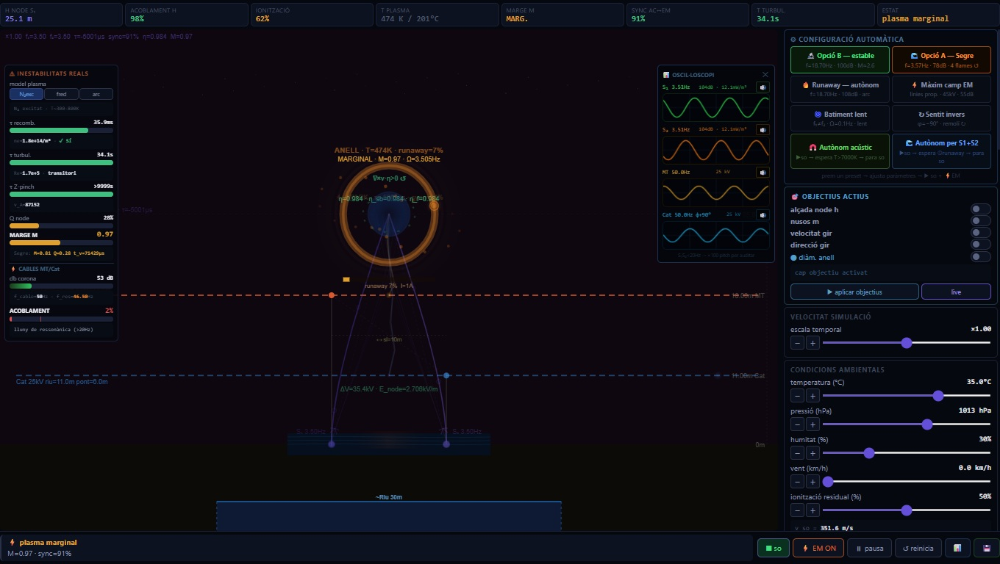

# Velo Toroide - Plasma Ring



**🌐 [Simulador web](https://bioquad.github.io/Velo-Toroide/)**

---

## Projecte: Observació i anàlisi del fenomen del riu Segre (2022)

### Descripció

Aquest repositori conté la documentació factual i l'anàlisi teòrica basada en l'observació d'un fenomen lluminós toroïdal registrat el 18 de setembre de 2022 a Lleida (pont del Príncep de Viana). L'objectiu és proporcionar dades precises a la comunitat científica i a les persones interessades en fenòmens atmosfèrics anòmals.

### Estructura del repositori

```
.
├── assets/                 Plànols, esbós i representació del toroide
├── docs/                   Documents d'observació i de simulació (català i anglès)
│   ├── Explicacio_observacio_toroide_cat.docx
│   ├── Explicacio_simulacio_toroide_cat.docx
│   ├── Observation_toroid_plasma_explanation_eng.docx
│   └── Simulation_toroid_plasma_explanation_eng.docx
├── simulation/
│   ├── v041/               Simulador actual (física establerta)
│   │   ├── index.html
│   │   ├── fisica.js       Nucli de física: funcions pures i testejables
│   │   ├── ui.js           Interfície, integració temporal i dibuix
│   │   └── estil.css
│   └── toroide_plasma_simulacio_V040_59.html   Model anterior (el que descriuen els documents)
├── tests/fisica.test.js    Proves del nucli de física
├── index.html              Redirecció al simulador
└── LICENSE.txt             GNU GPL v3 (codi)
```

### El simulador V041: què fa i què no fa

La versió V041 substitueix els factors ajustats a mà de la V040 (amplificació ressonant k = 25, un «sincronisme» que reduïa el llindar de ruptura, constants arbitràries d'escalfament) per **física establerta i publicada**. Si una condició no es compleix, el simulador ho mostra en lloc d'amagar-ho. El panell «comparació amb l'observació» indica, punt per punt, quines característiques del fenomen reprodueix cada configuració.

| Bloc | Model físic | Referència |
|---|---|---|
| So | Pistó amb pantalla (fórmula exacta a l'eix), font imatge a l'aigua (reflector rígid), absorció atmosfèrica, distància de xoc | Kinsler & Frey; Blackstock |
| Formació de l'anell | Jet sintètic: criteri de Holman (U₀/ωD > 0.16), model de «slug» Γ = πu²/4ω, nombre de formació ≤ 4 | Holman et al. 2005; Gharib et al. 1998 |
| Dinàmica de l'anell | Velocitat autoinduïda de Saffman, difusió turbulenta del nucli, nodes per inestabilitat de Widnall (n ≈ 2.5·R/a) | Saffman 1970; Widnall & Tsai 1977 |
| Camp elèctric | Línies infinites amb conductor imatge, superposició fasorial MT + catenària, valor de pic exacte | Electrostàtica clàssica |
| Ruptura de l'aire | Camp reduït crític E/N ≈ 120 Td amb la densitat local rebaixada per la rarefacció acústica | Raizer, *Gas Discharge Physics* |
| Efecte corona | Llei de Peek a la superfície del conductor | Peek 1929 |
| Plasma | Balanç d'electrons (ionització natural, captura per O₂, recombinació), conductivitat de Drude, escalfament Joule | Raizer |
| Visibilitat | Profunditat òptica del traçador (pols o fum), condensació per la caiguda de pressió al nucli, emissió tèrmica o de descàrrega | Koschmieder; Magnus |
| Trampa acústica | Força de radiació de Gor'kov sobre aire calent: Λ = v²k/2g > 1 per quedar atrapat a λ/2 | Gor'kov 1962 |

**Resultats principals amb les dades del Segre:**

- **Es pot formar un toroide amb so.** Una font d'infrasò de ~0.15 Hz, a ~140 dB a 1 m i a través d'una obertura de ~21 m, genera un anell de vòrtex de 25 m de diàmetre amb 4 nodes de Widnall. És inaudible i acústicament lineal (Mach < 0.1). Amb un batement f₁−f₂ = 4/7 Hz, el patró de 4 nodes faria una volta cada 7 s (aquest acoblament entre el batement i els nodes és una hipòtesi).
- **Les línies de 25 kV no poden ionitzar l'aire a l'altura del node.** El camp hi és ~10⁵ vegades inferior al de ruptura (~2.9 MV/m), i la rarefacció acústica només el rebaixa una fracció mínima. Tampoc no hi ha efecte corona als conductors.
- Un anell així seria **invisible** si no arrossega pols o fum en concentracions altes, i es desplaçaria a ~10 m/s per la seva pròpia velocitat, no a la velocitat de la brisa.

### Execució de les proves

```
node tests/fisica.test.js
```

### Llicències

- Codi del simulador: **GNU GPL v3** (vegeu `LICENSE.txt`).
- Document de simulació: **GNU FDL v1.3**.
- Document d'observació: distribució lliure amb atribució.

### Nota

Els models presentats són hipòtesis de treball i no s'han validat experimentalment.

---

## Project: Observation and Analysis of the Segre River Phenomenon (2022)

This repository contains factual documentation and theoretical analysis of a toroidal luminous phenomenon observed on 18 September 2022 in Lleida (Prince of Viana Bridge).

**Simulator V041** replaces the hand-tuned factors of V040 (resonant amplification k = 25, a "synchronism" factor that lowered the breakdown threshold, arbitrary heating constants) with established, published physics. This covers synthetic-jet vortex ring formation (Holman, Gharib), Saffman ring velocity, the Widnall instability, line-charge electrostatics with image conductors, the reduced-field breakdown criterion (E/N ≈ 120 Td), Peek's corona law, a Drude/Joule plasma balance, optical visibility of tracers and the Gor'kov acoustic radiation force. A built-in panel compares each configuration with the observation, point by point.

Key results for the Segre geometry: an infrasonic source (~0.15 Hz, ~140 dB at 1 m, ~21 m aperture) can produce a 25 m vortex ring with 4 Widnall nodes, and the ring is inaudible and linear. However, the 25 kV lines produce a field ~10⁵ times below air breakdown at the ring height, and the ring would be invisible unless it carried a dense tracer.

Run the tests with `node tests/fisica.test.js`.

Licences: simulator code GNU GPL v3 (`LICENSE.txt`); simulation document GNU FDL v1.3; observation document free distribution with attribution.

*The physical models are working hypotheses and have not been experimentally validated.*
